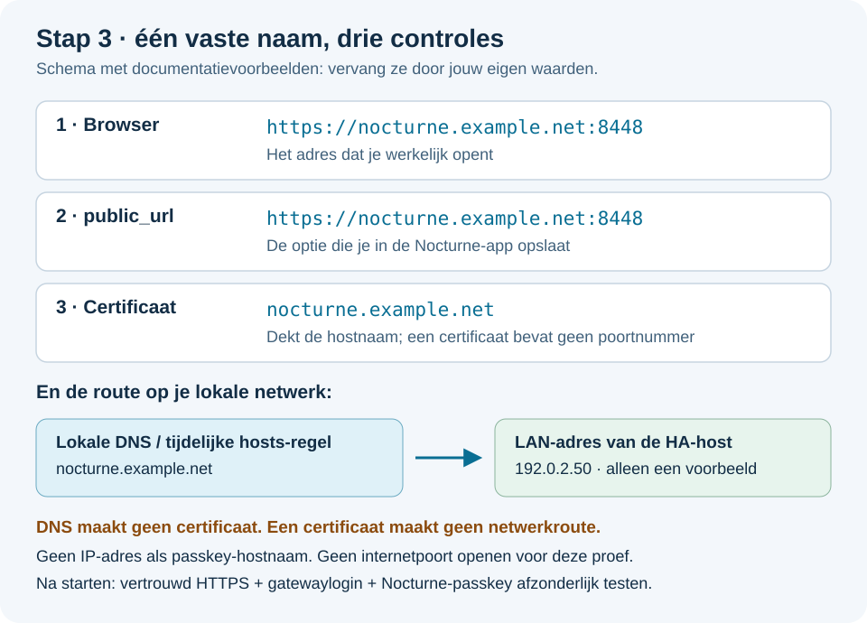

# HTTPS en lokale DNS: het adres waarop passkeys werken

[Terug naar de installatiehandleiding, stap 3](INSTALLATIE.md#stap-3-domeinnaam-dns-en-certificaat)

Je wilt één vaste naam gebruiken, bijvoorbeeld je eigen DuckDNS-hostnaam. Die naam moet lokaal naar HA leiden en in het vertrouwde certificaat staan. **Je hoeft Nocturne daarvoor niet vanaf internet bereikbaar te maken.** Deze pagina beschrijft voorbereidingen; verander geen bestaande netwerk-/certificaatconfiguratie zonder te controleren wie die nog meer gebruikt.



## Kies de juiste route

| Jouw situatie | Volg |
|---|---|
| Je hebt al een vertrouwd certificaat voor je vaste naam in HA `/ssl` | [Bestaand certificaat](#a-bestaand-certificaat-gebruiken), daarna lokale DNS |
| Je gebruikt DuckDNS maar hebt nog geen certificaat | [DuckDNS-certificaat](#b-certificaat-via-de-duckdns-app), daarna lokale DNS |
| Je hebt een andere DNS-provider/certificaatmethode | Gebruik diens bestaande uitgifteprocedure; de eindproducten zijn de certificaatketen en bijpassende sleutel in `/ssl` |
| Alleen een naam zoals `homeassistant.local` of een IP-adres beschikbaar | Voor volledige passkey-setup heb je eerst een geschikte vaste naam en een door jouw apparaten vertrouwd certificaat nodig |

De laatste route kan ook met een eigen vertrouwde certificaatautoriteit, maar het correct uitrollen van die vertrouwensketen valt buiten deze beginnershandleiding. Gebruik geen browserwaarschuwing-omzeiling als vervanging.

## A: bestaand certificaat gebruiken

1. Controleer voor welke **hostnaam** het certificaat is uitgegeven, de verloopdatum en of de volledige keten beschikbaar is.
2. Controleer dat certificaat én bijpassende private sleutel in HA `/ssl` staan. Bij gebruik van DuckDNS staan ze daar doorgaans al; opnieuw uploaden is dan niet nodig.
3. Noteer alleen de **bestandsnamen** voor de Nocturne-opties. Gebruik bij voorkeur je bestaande namen; overschrijf geen certificaat dat andere apps gebruiken.

Voorbeeldkoppeling:

| Bestand op HA | Nocturne-optie |
|---|---|
| `/ssl/fullchain.pem` | `certificate: fullchain.pem` |
| `/ssl/privkey.pem` | `private_key: privkey.pem` |

Nocturne heeft `/ssl` alleen-lezen gekoppeld. Het maakt met deze opties geen wijzigingen aan HA Core of het certificaatbestand. Een ingestelde bestandsnaam bewijst op zichzelf nog niet dat de browser het certificaat vertrouwt; dat test je na het starten.

## B: certificaat via de DuckDNS-app

**Voorwaarde:** de volledige DuckDNS-naam is in jouw eigen DuckDNS-account geregistreerd. Een voorbeeldnaam kopiëren maakt je niet de eigenaar. Heb je al een werkende DuckDNS-configuratie, behoud de bestaande domeinen/token en controleer alleen de certificaatopties.

1. Open in HA **Instellingen → Apps → App installeren**, zoek **Duck DNS / DuckDNS** en installeer de officiële app indien nodig.
2. Open **Configuratie**. Vul jouw volledige domeinnaam bij **Domains** in en jouw token bij **Token**. Het token blijft geheim.
3. Klap **Let's Encrypt** open. Lees [de voorwaarden](https://letsencrypt.org/repository/) en zet `accept_terms` alleen aan als je daarmee instemt.
4. Gebruik `certfile: fullchain.pem` en `keyfile: privkey.pem`, tenzij die bestanden bewust voor een ander certificaat worden gebruikt. Laat het bestaande ondersteunde algoritme staan.
5. Klik **Opslaan**. Start DuckDNS, of herstart deze app als hij al draaide.
6. Bekijk **Logboeken**. Wacht op succesvolle validatie/uitgifte en het aanmaken van `fullchain.pem`; uitsluitend “Starting DuckDNS” is nog geen geslaagd certificaat.

De bestanden worden in `/ssl` gezet. Zie de [officiële DuckDNS-documentatie](https://github.com/home-assistant/addons/blob/master/duckdns/DOCS.md).

> [!IMPORTANT]
> Het officiële DuckDNS-document bevat ook instructies voor HTTPS op **HA Core**. **Neem dat `http:`-blok niet over voor deze Nocturne-installatie.** Nocturne heeft zijn eigen HTTPS-gateway op poort 8448. Je bestaande HA-adres hoeft niet te veranderen. Open ook geen routerpoorten alleen om deze lokale proef te laten werken.

## C: lokale DNS naar de HA-host

DuckDNS kan publiek naar je internetverbinding wijzen. Dat is niet hetzelfde als rechtstreeks naar de HA-host op je lokale netwerk. Voor deze test is een lokale DNS-regel het duidelijkste uitgangspunt:

```text
jouw exacte Nocturne-hostnaam  →  het LAN-IPv4-adres van de HA-host
```

1. Zoek het **werkelijke LAN-adres** van je HA-host via je router of HA's netwerkpagina. Maak het adres bij voorkeur stabiel met een DHCP-reservering.
2. Maak op de DNS-server die je apparaten gebruiken een lokale regel voor **alleen die exacte hostnaam**. De functie kan **DNS rewrite**, **DNS override**, **lokale DNS-record** of vergelijkbaar heten; het klikpad hangt af van je router/DNS-software.
3. Vul als doel het IPv4-adres van HA in, zonder `https://` en zonder `:8448`—DNS verwijst naar een adres, niet naar een poort.
4. Zorg dat ook je pc/telefoon daadwerkelijk deze DNS-server gebruikt. Browser Secure DNS/DoH, een VPN of een andere DNS-server kan de lokale regel passeren.
5. Controleer ook een eventueel **AAAA-record**. Bij de eerste versie is IPv6-hostpoorttoegang niet gevalideerd. Corrigeer de DNS-route voor deze ene hostnaam; schakel niet zomaar IPv6 op het hele netwerk uit.

**Let op hergebruik van een domeinnaam:** een DNS-regel geldt voor alle poorten op die naam. Gebruik je dezelfde naam al voor iets anders, controleer dat dit naar dezelfde host hoort of kies vóór accountaanmaak een aparte naam met passend certificaat.

Een hosts-regel op één Windows-pc is een beperkte testmogelijkheid. Een telefoon kan die regel niet overnemen; voor gebruik op meerdere apparaten is werkende lokale DNS nodig.

## D: tijdelijke Windows-test met hosts-bestand

Deze procedure is handmatig en verandert alleen naamresolutie op die ene pc. Bewaar bestaande regels. **Vervang beide voorbeeldwaarden door je echte HA-adres en je eigen certificaathostnaam.** `192.0.2.50` en `nocturne.example.net` hieronder zijn gereserveerde documentatievoorbeelden, geen werkend thuisnetwerk.

1. Open Start, zoek **Kladblok**, klik er met rechts op en kies **Als administrator uitvoeren**. Bevestig de Windows-vraag zelf.
2. Kies **Bestand → Openen**. Ga naar:

   ```text
   C:\Windows\System32\drivers\etc\hosts
   ```

3. Kies bij bestandstype **Alle bestanden**, zodat `hosts` zichtbaar is.
4. Bewaar eerst een back-up via **Opslaan als** in je eigen documentenmap, met een herkenbare naam zoals `hosts-voor-nocturne.bak`. Open daarna opnieuw het **originele** `hosts`-bestand vóór bewerken.
5. Voeg één regel toe met je eigen waarden, bijvoorbeeld in deze vorm:

   ```text
   192.0.2.50 nocturne.example.net
   ```

6. Sla het originele bestand op als **hosts**, zonder `.txt`. Krijg je geen schrijfrechten, controleer of Kladblok echt als administrator is geopend; verander niet de beveiligingsrechten van de hele map.
7. Open PowerShell en vernieuw de Windows DNS-cache:

   ```powershell
   ipconfig /flushdns
   ```

8. Sluit de Nocturne-tab en open later opnieuw de **domeinnaam**, niet het IP-adres. Bij een hardnekkig oud adres kan ook een browserherstart nodig zijn.

Terugdraaien: verwijder alleen de eigen toegevoegde regel (of herstel zorgvuldig de back-up als er intussen niets anders veranderd is), sla op en vernieuw opnieuw de cache. Verwijder geen andere regels.

## Bereikbaarheid controleren na starten

Voer deze controles pas uit nadat [installatiestap 5](INSTALLATIE.md#stap-5-starten-en-dienststatus-controleren) gereed is. Windows-voorbeelden, steeds met je **eigen** hostnaam:

### 1. Naam en poort

```powershell
Test-NetConnection nocturne.example.net -Port 8448
```

Controleer `RemoteAddress` en `TcpTestSucceeded`. Het eerste hoort bij de gekozen route naar HA; het tweede moet `True` zijn. Dit bewijst alleen een TCP-verbinding, nog geen vertrouwd TLS-certificaat of Nocturne-login. `nslookup` ondervraagt DNS en is geen bewijs dat een Windows hosts-regel wordt gebruikt.

De velden en werking staan ook in [Microsofts Test-NetConnection-documentatie](https://learn.microsoft.com/en-us/powershell/module/nettcpip/test-netconnection).

### 2. HTTPS zonder beveiligingsomzeiling

```powershell
curl.exe --connect-timeout 10 --max-time 20 -I https://nocturne.example.net:8448
```

Zonder gatewaygegevens is **HTTP 401 Unauthorized** hier juist een bruikbaar resultaat: de TLS-verbinding kwam tot stand en de gateway vraagt om inloggen. Controleer daarna ook het certificaat in de browser. Een certificaatfout, time-out of geweigerde verbinding is iets anders; voeg geen `-k` toe om die fout te verbergen.

Alleen als diagnose om DNS tijdelijk te onderscheiden van HTTPS (met jouw eigen IP/naam):

```powershell
curl.exe --connect-timeout 10 --max-time 20 --resolve nocturne.example.net:8448:192.0.2.50 -I https://nocturne.example.net:8448
```

`--resolve` houdt de **hostnaam en certificaatcontrole** intact, maar kiest voor deze ene opdracht het opgegeven adres. Werkt deze test wel en de normale opdracht niet, onderzoek dan naamresolutie/routing. Dit stelt niets blijvend in en laat je browser of telefoon niet automatisch werken.

Zie [de officiële curl-uitleg over --resolve](https://curl.se/docs/manpage.html#--resolve).

### 3. Browser

Open de URL zonder certificaatwaarschuwing, gebruik de gatewaygegevens uit HA en ga terug naar [installatiestap 6](INSTALLATIE.md#stap-6-het-echte-nocturne-openen). Pas een geslaagde browserlogin maakt de keten compleet.

## Onderhoud

Houd de DNS-naam stabiel en controleer of certificaatvernieuwing blijft werken. Vanaf wrapper 0.1.1 worden stabiele, passende vernieuwde bestanden automatisch gecontroleerd en door alleen nginx herladen. Bekijk **Installatiecontrole** en controleer daarna ook het certificaat in je browser. Zie [werking, foutcodes en grenzen](CERTIFICATEN.md). Op 0.1.0 was nog een app-herstart nodig. Een domeinwijziging na accountaanmaak is geen gewone cosmetische wijziging vanwege de passkey-/instantie-identiteit.

De Windows-opdrachten hierboven zijn diagnostiek, geen verzoek om wachtwoorden of tokens te delen. Plaats ook geslaagde uitvoer niet ongeschoond in een openbaar issue: die kan je netwerkadres of hostnaam bevatten.
