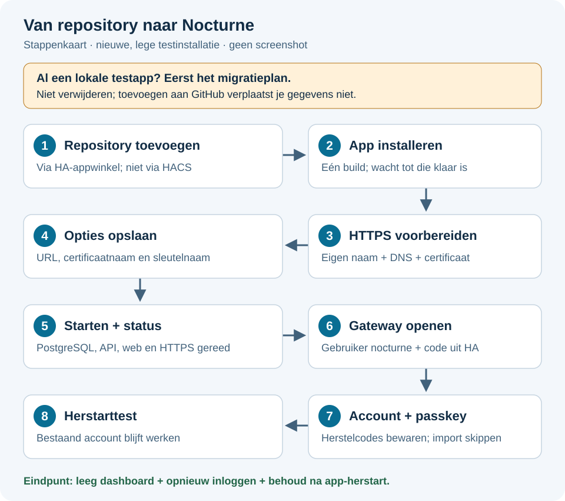
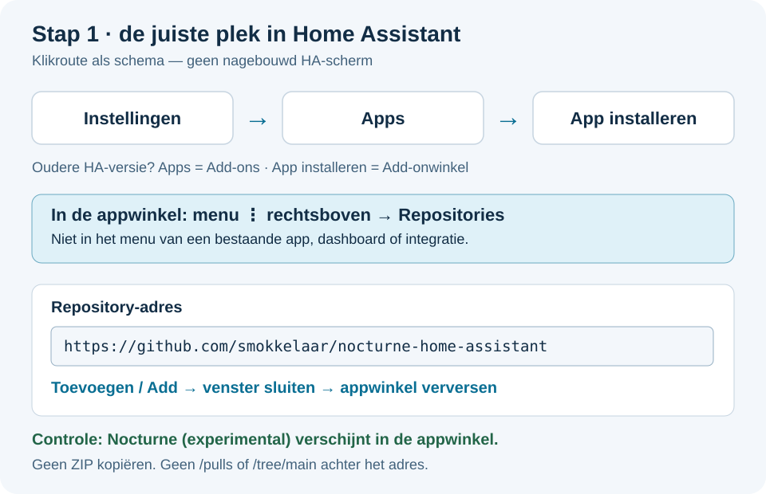
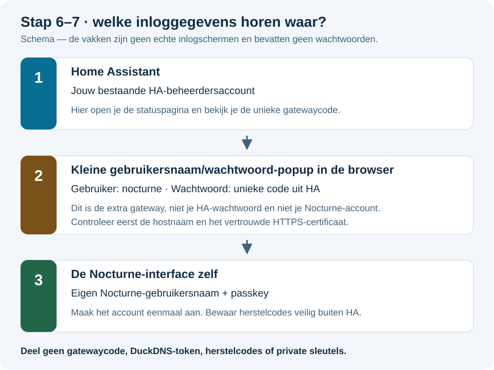

# Nocturne installeren: van repository tot werkend dashboard

**Nederlandse stap-voor-staphandleiding · twee gescheiden HA-apps · gecontroleerd op 1 september 2026.**

Doel: een **nieuwe, lege testinstallatie** openen via vertrouwd HTTPS, een account met passkey maken en na een app-herstart opnieuw kunnen inloggen. Dit is nog geen gevalideerde medische omgeving of handleiding voor CGM/pomp/Nightscout-import.

> [!WARNING]
> **Heb je al de lokale Nocturne-testapp? Stop vóór installeren of starten.** De repository-apps hebben andere interne identiteiten en gegevensmappen. Voeg de repository gerust toe, maar verwijder de lokale app niet. De lokale prototype-app en Official gebruiken standaard beide hostpoort 8448. Lees eerst [de migratiewaarschuwing](MIGRATION.md). Deze handleiding verplaatst geen bestaande accounts of gegevens.



*Alle afbeeldingen zijn door dit project gemaakte schema's, geen screenshots. Knopnamen en plaatsing kunnen per HA-versie/taal verschillen. Klik op een afbeelding om deze groter te openen.*

## Snel naar de juiste stap

| Stap | Wat doe je? | Klaar wanneer… |
|---|---|---|
| [Vooraf](#vooraf) | Installatie en benodigdheden controleren | Je gebruikt HA OS, amd64 en een beheerdersaccount |
| [1 — Repository](#stap-1-repository-toevoegen) | GitHub-adres toevoegen aan de appwinkel | De Nocturne-repository zichtbaar is |
| [2 — Installeren](#stap-2-de-app-installeren) | De container laten bouwen | De app de knop **Starten** toont |
| [3 — HTTPS](#stap-3-domeinnaam-dns-en-certificaat) | Domein, lokale DNS en certificaat voorbereiden | Naam, adres en certificaat bij elkaar passen |
| [4 — Configureren](#stap-4-nocturne-configureren) | Drie opties invullen en opslaan | De opgeslagen waarden correct terugkomen |
| [5 — Starten](#stap-5-starten-en-dienststatus-controleren) | Diensten starten en statuspagina openen | Alle vier diensten zijn gestart |
| [6 — Toegang](#stap-6-het-echte-nocturne-openen) | Standaard: gatewaycode gebruiken in de HTTPS-tab | Het Nocturne-installatiescherm verschijnt |
| [7 — Account](#stap-7-instantie-en-passkey-account-maken) | Instantie, passkey en herstelcodes instellen | Het lege dashboard verschijnt |
| [8 — Eindtest](#stap-8-controleren-of-alles-bewaard-blijft) | Opnieuw inloggen en app herstarten | Hetzelfde account blijft werken |

Probleem? Ga direct naar [foutmeldingen en oplossingen](#problemen-oplossen), niet opnieuw installeren.

## Vooraf

- [ ] **Home Assistant OS met Supervisor**, op **amd64**. Een gewone HA Container-installatie heeft deze appwinkel niet. ARM64 is in deze wrapper nog niet ondersteund.
- [ ] Je bent in HA ingelogd als **beheerder**. De Nocturne-statuspagina is alleen voor beheerders bedoeld.
- [ ] Er is vrije schijfruimte en geheugen voor PostgreSQL/API/web én voor HA zelf. Er is nog geen betrouwbaar minimum gemeten; alleen veel totale opslag zegt niet hoeveel vrij is.
- [ ] De HA-host heeft internettoegang om images en pakketten te downloaden.
- [ ] Je kiest één vaste eigen domeinnaam en hebt een browser/apparaat dat passkeys ondersteunt.
- [ ] Je bewaart nog geen echte medische gegevens in deze experimentele installatie.

**Wat niet nodig is:** HACS, ZIP downloaden, File Editor, bestanden naar `\\homeassistant.local\addons` kopiëren, een losse PostgreSQL-server of een wijziging aan `configuration.yaml`. De repository-app wordt door Supervisor geïnstalleerd.

In nieuwe HA-versies heet de pagina **Apps**; oudere versies gebruiken **Add-ons** en **Add-onwinkel**. Het gaat om dezelfde categorie, niet om **Apparaten & diensten → Integratie toevoegen**.

## Stap 1: repository toevoegen

### Makkelijkste route: de knop

[](https://my.home-assistant.io/redirect/supervisor_add_addon_repository/?repository_url=https%3A%2F%2Fgithub.com%2Fsmokkelaar%2Fnocturne-home-assistant)

1. Klik op de knop. Vraagt **My Home Assistant** om je HA-adres, gebruik dan het adres waarmee je normaal HA opent; dit is **niet** het nieuwe Nocturne-adres.
2. Ga verder naar jouw HA-installatie en controleer dat het voorstel precies deze repository noemt.
3. Bevestig het toevoegen. Log indien nodig eerst in bij HA.

### Handmatige route



1. Open **Instellingen → Apps → App installeren**. Bij oudere HA-versies: **Instellingen → Add-ons → Add-onwinkel**.
2. Klik **rechtsboven in de appwinkel** op het menu met de drie puntjes **⋮**.
3. Kies **Repositories**.
4. Plak uitsluitend dit adres, dus zonder `/pulls`, `/tree/main` of `/blob/...`:

   ```text
   https://github.com/smokkelaar/nocturne-home-assistant
   ```

5. Klik **Toevoegen / Add**, sluit het venster en ververs zo nodig de appwinkel.

**Controlepunt:** je ziet in dezelfde repository **Nocturne Official Release** en **Nocturne Latest Release**. De repository toevoegen installeert nog niets en importeert geen bestaande gegevens. De [officiële HA-repositorystappen](https://www.home-assistant.io/common-tasks/os/#installing-a-third-party-app-repository) tonen ook de appwinkelroute.

## Stap 2: de app installeren

1. Zoek in de appwinkel op **Nocturne**. Je krijgt twee keuzen uit dezelfde repository:

   | App | Kies deze voor | Gegevens | Standaard hostpoort |
   |---|---|---|---|
   | **Nocturne Official Release** | De handmatig bevorderde officiële Nocturne-release; aanbevolen als basis | Eigen map; behoudt de identiteit van eerdere repositoryversies | 8448 |
   | **Nocturne Latest Release** | Veelvuldig testen van een exact vastgezette upstream-`main`-momentopname | Volledig aparte map en eigen account/passkey | 8449 |

2. Open het gewenste kanaal uit de zojuist toegevoegde repository, niet een eventueel bestaande **Nocturne Local (test)**. [Lees de volledige kanaalvergelijking](CHANNELS.md). Beide repository-apps mogen geïnstalleerd blijven; ze hoeven niet tegelijk te draaien.
3. Lees de beschrijving en kies **Installeren / Install** één keer.
4. Wacht op de volledige build. De duur hangt af van je host, downloads en vrije ruimte; enkele minuten is normaal, langer kan ook.

**Controlepunt:** de appdetailpagina toont de gekozen naam, de geïnstalleerde wrapperversie en **Starten / Start**. **Start nog niet**; eerst bereiden we HTTPS voor. De wrapperversie en Nocturne-versie zijn verschillende versienummers, geen fout.

> [!TIP]
> Een fout **Another job is running** betekent dat er al een installatie/buildactie loopt. Klik niet herhaaldelijk op installeren of bijwerken. Controleer **Instellingen → Systeem → Logboeken → Supervisor** en wacht tot de lopende taak is afgerond of aantoonbaar mislukt.

## Stap 3: domeinnaam, DNS en certificaat

Dit is de belangrijkste voorbereiding. Alleen een draaiende app is niet voldoende voor passkeys.


Je hebt drie dingen nodig:

| Onderdeel | Wat moet kloppen? | Waar stel je het in? |
|---|---|---|
| **Vaste domeinnaam** | Een naam die je zelf beheert, bijvoorbeeld je eigen DuckDNS-naam | DNS-provider / DuckDNS |
| **Lokale bereikbaarheid** | Die naam brengt je vanaf jouw apparaat bij de HA-host | Lokale DNS-server; tijdelijk eventueel Windows hosts-bestand |
| **Vertrouwd certificaat** | Geldig voor precies die naam, met bijbehorende private sleutel | Bestanden in HA `/ssl`; Nocturne leest ze alleen |

**Heb je dit nog niet? Volg nu [Domein, DuckDNS, lokale DNS en Windows uitgelegd](HTTPS-EN-DNS.md)**. Daar staan de certificaatinstellingen, de lokale DNS-route en een volledige Windows-testprocedure.

Gebruik straks één adres in de vorm:

```text
https://nocturne.example.net:8448
```

`nocturne.example.net` is een **documentatievoorbeeld**, niet een werkend adres. Vervang de hele hostnaam door je eigen naam. Gebruik voor Official standaard poort **8448** en voor Latest **8449**. Gebruik geen IP-adres voor accountregistratie en verander de gekozen hostnaam niet zomaar nadat passkeys zijn aangemaakt. Een zelfondertekend testcertificaat overslaan in de browser is geen oplossing voor vertrouwde passkey-registratie.

**Controlepunt vóór stap 4:** je eigen hostnaam ligt vast, de naam wijst lokaal naar de HA-host, en het passende certificaat plus sleutel staan in `/ssl`. De poorttest en browsercontrole doen we nadat de app gestart is. Zet hiervoor geen internetpoorten open en verander HA's eigen HTTP/HTTPS-instellingen niet.

## Stap 4: Nocturne configureren

1. Ga terug naar **Instellingen → Apps** en open precies **Nocturne Official Release** of **Nocturne Latest Release**.
2. Open **Configuratie / Configuration**.
3. Vul onderstaande drie velden in. Als lege optionele velden verborgen zijn, schakel **Ongebruikte optionele configuratieopties tonen** in.

| Optie | Invullen | Niet invullen |
|---|---|---|
| `public_url` | Je volledige vaste URL, bijvoorbeeld Official `https://nocturne.example.net:8448` of Latest `https://nocturne.example.net:8449` | Geen IP, `/setup`, gebruikersnaam, wachtwoord of querystring |
| `certificate` | `fullchain.pem` of jouw eigen certificaatbestandsnaam | Geen `/ssl/` ervoor |
| `private_key` | `privkey.pem` of jouw eigen sleutelbestandsnaam | Niet de inhoud van de sleutel |

Als je de opties via **⋮ → Bewerken in YAML** invult, gebruik dan dit blok **alleen in de appconfiguratie** en vervang de voorbeeldhostnaam:

```yaml
public_url: https://nocturne.example.net:8448
certificate: fullchain.pem
private_key: privkey.pem
```

Gebruik je **Latest**, verander in dit voorbeeld alleen de poort naar `8449`. Laat de hostnaam gelijk aan de naam in het certificaat.

4. Klik **Opslaan / Save**. Open de configuratie eventueel opnieuw om te zien of de waarden bewaard zijn.
5. Controleer onder **Netwerk** de hostpoort: Official gebruikt standaard **8448/tcp → 8448**; Latest publiceert dezelfde interne containerpoort standaard als **8448/tcp → 8449**. De poort in `public_url` moet gelijk zijn aan de hostpoort rechts. Geef twee geïnstalleerde apps nooit dezelfde hostpoort.

**Controlepunt:** beide certificaatvelden zijn gevuld, het adres gebruikt `https://`, de naam klopt en de poort is beschikbaar. Laat **Automatisch bijwerken** tijdens deze experimentele fase uit.

> [!NOTE]
> Zijn beide certificaatvelden leeg, dan maakt de app een zelfondertekend testcertificaat. Dat is alleen voor een technische opstartproef, niet het einddoel van deze handleiding.

## Stap 5: starten en dienststatus controleren

1. Open de tab **Informatie / Info** van het gekozen Nocturne-kanaal en controleer de volledige appnaam.
2. Klik **Starten**. De eerste start maakt een eigen database en sleutels aan.
3. Open **Logboeken / Logs** bij deze app als het starten lijkt te blijven hangen.
4. Kies **Webinterface openen / Open Web UI**. Dit opent eerst de **HA-statuspagina**, nog niet het Nocturne-dashboard.
5. Klik zo nodig op **Status vernieuwen** op die pagina.

| Regel op de statuspagina | Wat verwacht je? |
|---|---|
| PostgreSQL | **gereed** |
| Nocturne API | **gereed** |
| Nocturne Web | **gereed** of **luistert; volledig inloggen nog testen** |
| HTTPS | **gereed** |

**Controlepunt:** alle vier diensten zijn gestart, er staat geen zelfondertekend-testcertificaatwaarschuwing bij een installatie met eigen certificaat, en de Nocturne-link wijst naar jouw gekozen hostnaam/poort. Een status **gereed** bewijst nog niet dat het certificaat op jouw apparaat vertrouwd is; dat controleer je in de volgende stap.

Vanaf app 0.1.1 staat hier ook **Installatiecontrole** met het ingestelde adres, certificaatverloop en herlaadstatus. Het blok **Nog op jouw browser te controleren** blijft bewust onbevestigd tot jij die stappen uitvoert. Zie [certificaatcontrole en foutcodes](CERTIFICATEN.md). Een ongeldig startcertificaat geeft een gerichte fout in **Logboeken**, voordat de statuspagina beschikbaar is.

Zie je **nog niet gestart**, **STARTFOUT** of **gestopt**? Lees de foutmelding; ga niet door met accountaanmaak en verwijder geen database of sleutels.

## Stap 6: het echte Nocturne openen



1. Klik op de HA-statuspagina op **Open het echte Nocturne-installatiescherm**. De naam van deze link blijft ook na de eerste setup zo; de applicatie bepaalt welk scherm opent.
2. Er opent een aparte tab op je ingestelde HTTPS-adres. Controleer de hostnaam en het certificaat via het icoon links van de adresbalk. **Stop bij een certificaatwaarschuwing**; gebruik geen IP-adres of beveiligingsomzeiling als oplossing.
3. Vraagt de browser in een klein venster om **Gebruikersnaam** en **Wachtwoord**? Dat is de extra **gatewaybeveiliging**, nog niet Nocturne zelf.
4. Ga terug naar de HA-statuspagina. Klap **Toegangscode voor deze lokale test tonen** open.
5. Gebruik in dat browservenster:

   ```text
   Gebruikersnaam: nocturne
   Wachtwoord:     de unieke code uit jouw HA-statuspagina
   ```

6. Klik **Inloggen**. Deel de code niet en stuur geen screenshot met het uitgeklapte wachtwoord.

**Controlepunt:** je ziet de donkere Nocturne-interface met **Name your instance** (nieuwe installatie), of het eigen Nocturne-inlogscherm als de instantie al bestaat. Je HA-account, gatewaycode en Nocturne-passkey zijn drie verschillende toegangen. Een browser kan de gatewaygegevens tijdens een sessie onthouden; niet iedere bezoekpoging toont daarom opnieuw het eerste venster.

> [!TIP]
> **Bestaat je eigenaar/passkey al?** Vanaf wrapper 0.1.4 kun je na een back-up alleen deze extra popup uitschakelen met `gateway_auth: false`. Nocturne's eigen passkey blijft verplicht en de app controleert dit vóór de HTTPS-poort opent. Doe dit niet tijdens de eerste setup. Volg de [exacte omschakel-, test- en herstelstappen](GATEWAY.md).

## Stap 7: instantie en passkey-account maken

### 7A — Name your instance

| Veld | Voorbeeld | Betekenis |
|---|---|---|
| **Slug** | `mijn-nocturne` | Korte interne naam; geen domeinnaam. Kies zorgvuldig: de UI vermeldt dat deze later niet gewijzigd kan worden. |
| **Instance name** | `Mijn Nocturne` | Leesbare naam van deze installatie |

1. Vul beide velden echt in; grijze voorbeeldtekst is geen ingevulde waarde.
2. Gebruik voor de slug minimaal drie tekens, met kleine letters/cijfers en eventueel koppeltekens.
3. Wacht op **Available** onder de slug; na typen volgt eerst een beschikbaarheidscontrole.
4. Klik daarna op **Continue**.

**Continue blijft grijs?** De knop vereist een door de server goedgekeurde slug én een niet-lege instantienaam. Bij **Checking availability...**, **Could not validate slug** of **Failed to fetch** moet eerst de verbinding/validatie werken. Alleen langer of vaker klikken lost dat niet op. Zie [problemen oplossen](#problemen-oplossen).

### 7B — Create your account

1. Vul **Display name** in: de naam die Nocturne bij je account toont.
2. Kies een **Username** van minimaal drie tekens en wacht op **Available**.
3. Klik **Create account with passkey**.
4. Rond het dialoogvenster van je browser/Windows Hello/telefoon/wachtwoordmanager zelf af. Welke keuzemogelijkheden verschijnen hangt af van jouw apparaat. De gatewaycode is hier geen vervanging voor een passkey.
5. Bewaar de getoonde **recovery codes / herstelcodes** veilig buiten deze HA-installatie, bijvoorbeeld in je eigen wachtwoordmanager. Niet in GitHub, een chat of een screenshot.
6. Bevestig dat je de codes hebt bewaard en kies **Continue Setup**.

**Controlepunt:** het account is aangemaakt en je hebt zelf toegang tot de passkey én de herstelcodes. Verschijnt **IP-adres is an invalid domain**, ga terug naar stap 3: accountregistratie hoort op de vaste vertrouwde domeinnaam.

### 7C — Nightscout of gegevensbron

Verschijnt **Connect your Nightscout**, een uploaderkeuze of een vraag naar een gegevensbron? Kies **Skip / Overslaan** of de optie om dit later te doen; de precieze tekst kan per Nocturne-scherm verschillen. Kies bij een keuze tussen een nieuwe start en een import de **nieuwe/lege start**. Voer in deze proef geen Nightscout-token, CGM/pomp-koppeling of behandelgegevens in.

**Controlepunt:** het **Nocturne-dashboard** verschijnt. Lege grafieken of ontbrekende meetgegevens zijn nu te verwachten: er is bewust geen gegevensbron gekoppeld. Daarmee werkt de lokale installatie, niet automatisch iedere Nocturne-functie of connector.

## Stap 8: controleren of alles bewaard blijft

1. Meld je via Nocturne's accountmenu af en daarna met je passkey weer aan op **hetzelfde HTTPS-adres**.
2. Controleer dat je in hetzelfde account en dezelfde instantie terugkomt.
3. Ga in HA naar **Instellingen → Apps → het gekozen Nocturne-kanaal → Informatie → Herstarten**. Herstart alleen deze app, niet het andere kanaal, heel HA of de Hyper-V-machine.
4. Wacht totdat de vier diensten weer gereed zijn en open Nocturne opnieuw.
5. Als opnieuw aanmelden nodig is, gebruik je bestaande passkey. Je mag **niet opnieuw een instantie of eigenaar hoeven aanmaken**.

### Afvinklijst: klaar voor verder testen

- [ ] Ik gebruik mijn vaste HTTPS-hostnaam zonder certificaatwaarschuwing.
- [ ] De HA-statuspagina toont vier gestarte diensten.
- [ ] De gatewaycode werkt en is niet gedeeld.
- [ ] Het Nocturne-dashboard opent met mijn eigen account.
- [ ] Afmelden en opnieuw aanmelden met de passkey werkt.
- [ ] Na een app-herstart blijft hetzelfde account werken, zonder nieuwe setup.
- [ ] Mijn herstelcodes zijn veilig buiten HA bewaard.
- [ ] Er is nog geen medische gegevensbron gekoppeld.

**Je lege testinstallatie is nu operationeel.** Zet daarna desgewenst **Bij systeemstart starten** aan. Dit vervangt geen volledige herstarttest van HA/VM; die is een aparte volgende proef.

Maak vóór upgrades of verdere inrichting via **Instellingen → Systeem → Back-ups** een back-up waarin precies deze app is opgenomen en bewaar een kopie buiten HA. Official en Latest hebben afzonderlijke back-updata; een back-up van de ene is geen herstelkopie van de andere. De app vraagt een koude back-up; **volledig terugzetten en migratie moeten nog apart worden getest**. Downloadbare back-ups, herstelcodes en database-/instantiesleutels zijn verschillende dingen en moeten veilig bewaard blijven.

## Problemen oplossen

| Wat zie je? | Controle / veilige vervolgstap |
|---|---|
| Geen **Apps / Add-ons** | Controleer dat je HA OS met Supervisor gebruikt en als beheerder bent ingelogd. Dit pakket installeer je niet via HACS. |
| Repository toegevoegd, geen app zichtbaar | Ververs de appwinkel, controleer het volledige repository-adres en **amd64**. Lees bij blijvende afwezigheid de Supervisor-logboeken. |
| **Another job is running** | Er loopt al een installatie-/buildtaak. Wacht op het resultaat in Supervisor; klik niet steeds opnieuw. |
| **Image … does not exist** | De gewenste versie heeft nog geen geslaagde imagebuild. Lees eerst de Supervisor-buildfout; alleen herstarten maakt geen image. |
| Certificaatbestand ontbreekt / **STARTFOUT** | Controleer de bestanden in `/ssl` en de twee kale bestandsnamen in de appopties. Lees of deel nooit de private sleutel om dit te bewijzen. |
| **ERR_CONNECTION_CLOSED**, weigering of time-out | Controleer dienststatus, de gekozen hostpoort (Official 8448 / Latest 8449) en DNS via [de HTTPS/DNS-test](HTTPS-EN-DNS.md#bereikbaarheid-controleren-na-starten). Een werkende HA-poort 8123 bewijst niets over de Nocturne-poort. |
| Via IP lijkt er iets te werken, via domeinnaam niet | Controleer lokale A/AAAA-resolutie. Los de route voor die naam op; vervang de passkey-hostnaam niet door het IP-adres. Schakel IPv6 niet overal uit als snelle oplossing. |
| Certificaatwaarschuwing | Naam, geldigheid, keten of vertrouwensstatus klopt niet. Herstel dit vóór login; geen `-k` of browserbeveiligingsomzeiling. |
| Gebruikersnaam/wachtwoord-popup | Standaard: gebruik gatewaygebruiker **nocturne** en de code uit HA. Bestaande ingerichte instanties kunnen vanaf 0.1.4 [veilig naar alleen Nocturne-passkey omschakelen](GATEWAY.md). |
| **Continue** blijft grijs | Vul beide velden in en wacht op **Available**. De servervalidatie moet slagen; zie stap 7A. |
| **Failed to fetch** | Controleer eerst normale HTTPS-toegang, gatewaylogin, appstatus en dezelfde hostnaam/poort. Herlaad de tab na correcties; noteer of het gebeurt vóór of ná het passkeyvenster. Niet opnieuw installeren of sleutels wissen. |
| **invalid domain** bij passkey | Je gebruikt waarschijnlijk een IP-adres of een verkeerde domein/origin-instelling. Volg stap 3 en 4; wijzigen van een al gebruikte identiteit vraagt extra zorg. |
| Na herstart weer **Name your instance** | Stop. Controleer of je dezelfde app en URL opent. Een nieuwe repository-installatie kan leeg zijn terwijl de oude lokale app de gegevens nog heeft. Maak niet meteen een nieuw account; lees MIGRATION.md. |
| Certificaat vernieuwd maar browser ziet het oude | Vanaf 0.1.1: wacht ongeveer 15–45 seconden en ververs **Installatiecontrole**. Een verkeerd/half bijgewerkt paar wordt niet geladen. Zie [foutcodes](CERTIFICATEN.md); controleer daarna een nieuwe browserverbinding. Op 0.1.0 was nog een app-herstart nodig. |

Voor hulp: meld **bij welke stap**, de HA-app- en Nocturne-versie, het type installatie en een kort **geschoond** foutfragment. Supervisor-logboeken zijn voor de build/installatie; app-logboeken voor het starten van PostgreSQL/API/web/nginx. Deel geen privé-IP's/domeinen, tokens, gatewaycode, herstelcodes of gezondheidsgegevens.

## Updates en verder bouwen

Official controleert upstream alleen nadat een beheerder de handmatige releaseworkflow start en wordt nooit automatisch samengevoegd. Latest controleert dagelijks een nieuwe upstream-`main`-momentopname en mag uitsluitend zijn eigen pakket na alle verplichte tests automatisch samenvoegen. Automatisch installeren in HA is per app een aparte gebruikersinstelling. Laat dit voor Official uit; zet het voor Latest pas aan wanneer je Latest-data vervangbaar houdt en back-ups hebt getest. Zie [updatebeleid](UPDATES.md), [kanaalgrenzen](CHANNELS.md), [bekende beperkingen](TESTING.md) en [overdracht voor ontwikkelaars/AI](AI_HANDOFF.md).

Wil je de resterende gaten helpen oplossen? In het [oplosplan](OPLOSPLAN.md) staat per onderwerp een concrete aanpak, prioriteit en acceptatietest. Dit zijn voorstellen, geen al aanwezige functies.

## Bronnen en onderhoud

De uitleg combineert de [eigen appconfiguratie](../nocturne_local/config.json), [gateway/statuscode](../nocturne_local/rootfs/opt/nocturne-ha/settings.py), [officiële HA-appwinkelroute](https://www.home-assistant.io/common-tasks/os/#installing-a-third-party-app-repository) en Nocturne 0.2.4's [instantieformulier](https://github.com/nightscout/nocturne/blob/66c35837d3719b592fa25e0aa09bb5f1c33c14a5/src/Web/packages/app/src/routes/%28unauthenticated%29/setup/steps/TenantIdentity.svelte) en [accountformulier](https://github.com/nightscout/nocturne/blob/66c35837d3719b592fa25e0aa09bb5f1c33c14a5/src/Web/packages/app/src/routes/%28unauthenticated%29/setup/steps/AccountCreation.svelte). Controleer bij nieuwe versies opnieuw de veldnamen en validatiestappen; de schema's zijn geen bewijs van een live uitgevoerde installatie.
